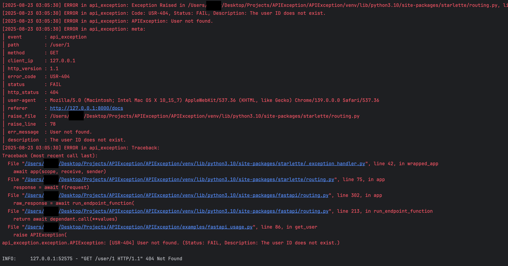

# 🪵 Logging & Debug

Good exception handling is only half the battle — **logging** is what keeps your team sane in production.  
With APIException, unexpected errors don’t just return a nice JSON response;  
they’re also **automatically logged** in a clean, structured way.  
---

## ✅ How It Works

**Auto-logging:**
```python
from api_exception import register_exception_handlers
from fastapi import FastAPI

app = FastAPI()
register_exception_handlers(
    app=app,
    use_fallback_middleware=True
)
```
You get two powerful behaviors:

1️⃣ **All handled APIExceptions** are logged with:
- HTTP status
- Exception code
- Message
- Context & traceback

2️⃣ **Unhandled exceptions** (like DB errors, 3rd-party failures) are caught by the fallback middleware and:
- Return a consistent JSON error response (ISE-500 by default)
- The full traceback to your console or logging system


---

## 🔔 Log Levels

APIException uses Python’s built-in logging levels.  
Here’s a quick guide:

| Level   | Numeric Value | When to use                                                                 |
|---------|---------------|------------------------------------------------------------------------------|
| DEBUG   | 10            | Detailed internal information for debugging (dev mode only).                 |
| INFO    | 20            | High-level application flow information (startup, shutdown, major events).   |
| WARNING | 30            | Something unexpected happened but the app can still continue.                |
| ERROR   | 40            | Serious issues where an operation failed (exceptions, DB errors, etc.).      |
| CRITICAL| 50            | Severe errors that may crash the application or require immediate attention. |

```python
from api_exception import logger
logger.setLevel("DEBUG")
```

---

## 🧩 Custom Log Fields

Custom log fields give you the flexibility to enrich your logs with **business-specific context**.  
Instead of only seeing technical details (status code, path, traceback), you can include **who the user was, which service made the call, or masked identifiers**.  

This is especially useful in **microservice architectures** or when debugging **customer-facing issues**, since your logs will carry both technical and business context together.

## `log_header_keys`:

Choose which request headers appear in logs:

```python
from api_exception import register_exception_handlers
from fastapi import FastAPI

app = FastAPI()
register_exception_handlers(
    app,
    log_header_keys=("x-request-id", "x-user-id")
)
```

## `extra_log_fields`:

Sometimes you need more than just the basics in your logs.  
With `extra_log_fields`, you can inject **custom metadata** into every log record.

### Example

```python
from api_exception import register_exception_handlers
from fastapi import FastAPI, Request

app = FastAPI()

def my_extra_fields(request: Request, exc: Exception):
    def mask(value: str, visible: int = 4) -> str:
        """Mask sensitive data (keep last `visible` chars)."""
        if not value or not isinstance(value, str):
            return value
        if len(value) <= visible:
            return "*" * len(value)
        return "*" * (len(value) - visible) + value[-visible:]

    return {
        "user_id": request.headers.get("x-user-id", "anonymous"),
        "custom_tag": "billing-service",
        "has_exception": exc is not None,
        # Masked sensitive fields
        "authorization": mask(request.headers.get("authorization", "")),
        "api_key": mask(request.query_params.get("api_key", "")),
    }

register_exception_handlers(app, extra_log_fields=my_extra_fields)
```

#### 🔍 What this does

• Adds user_id to every log (or “anonymous” if missing).

• Adds a service tag (billing-service) so logs are easy to filter.

• Marks if the log was attached to an exception.

• Masks sensitive fields like Authorization headers and API keys.

!!! important
    Define them once you register [`register_exception_handlers`](../usage/register_exception_handlers.md) and you use across the routers. 


This makes logs safer and more useful especially in multi-service environments.

#### Example log output

```bash
event=api_exception path=/user/1 method=GET http_status=404
user_id=12345 custom_tag=billing-service has_exception=True
authorization=********abcd api_key=*****f9d2
```

#### Example General Usage

```python
from api_exception import logger

logger.debug("Debugging details: user_id=42, payload=...")  
logger.info("Service started successfully on port 8000")  
logger.warning("Slow query detected, taking longer than 2s")  
logger.error("Failed to connect to Redis")  
logger.critical("Database unreachable! Shutting down...")
```

---

## 📂 File Logging

By default, APIException logs are written to the console.  
If you want to **persist logs to a file**, you can attach a file handler:

```python
from api_exception import add_file_handler, logger

# Send all logs to api_exception.log with DEBUG level
add_file_handler("api_exception.log", level="DEBUG")

logger.info("Application started")
logger.warning("Something looks suspicious")
logger.error("An error occurred")
```
This is useful in **production environments**, where you need logs for audit trails, monitoring, or shipping them to log aggregators like **ELK**, **Loki**, or **CloudWatch**.

---

## ⚙️ Example Output

When an exception happened, you’ll see logs like:



When something unexpected happens, you’ll see logs like:


---

## ⚡ Tips

✅ Use FastAPI’s native logging module to pipe logs to your file, console, or external log aggregator (ELK, CloudWatch, etc.).

✅ Combine this with FastAPI middlewares or your own log formatter if you want structured JSON logs.

✅ For sensitive environments, make sure your logs do not expose user data.

---

## 📚 Next

✔️ Want to see how fallback works?  
Check out [🪓 Fallback Middleware](../usage/fallback.md)

✔️ Need better Swagger docs?  
Go to [📚 Swagger Integration](swagger.md)

✔️ Haven’t defined custom codes yet?  
Read [🗂️ Custom Exception Codes](../usage/custom_codes.md)

