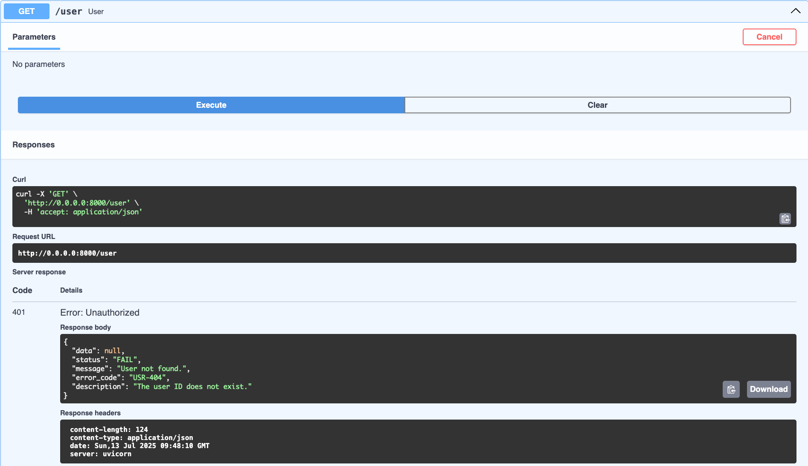
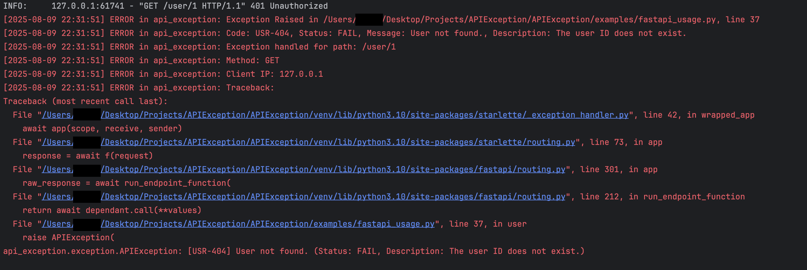

# 🗂️ Using Custom Exception Codes

Defining your own **business-specific error codes** keeps your API predictable, self-documenting, and easy to maintain.

The `BaseExceptionCode` in **APIException** gives you a simple pattern to organize, reuse, and expand your error codes — all while keeping them consistent across your endpoints.

---

## ✅ Why Use Custom Codes?

✔️ Consistent error structure for your entire API  
✔️ Human-readable, unique codes for each failure scenario  
✔️ Easy for frontend or clients to handle specific cases

---

## 📌 Example: Define and Raise

### ✅ Define Your Codes

Create your own class by extending `BaseExceptionCode` and declare your error codes once:

```python
from api_exception import BaseExceptionCode

class CustomExceptionCode(BaseExceptionCode):
    # Format: KEY = (code, message, description)
    USER_NOT_FOUND = ("USR-404", "User not found.", "The user ID does not exist.")
    INVALID_API_KEY = ("API-401", "Invalid API key.", "Provide a valid API key.")
    PERMISSION_DENIED = ("PERM-403", "Permission denied.", "Access to this resource is forbidden.")
```

### ✅ Use Them with APIException
Raise your custom error with full `typing`, `logging`, and `standardized` response:

```python
from api_exception import APIException

raise APIException(
    error_code=CustomExceptionCode.USER_NOT_FOUND,
    http_status_code=403
)
```
In the above example, if we raise the `APIException()`, the response will look like the below image.


And it will automatically log the event. Log format can be seen in the below image.



### 🏷️ How It Looks in Responses

✔️ Clear.

✔️ Always consistent.

✔️ Fully documented in Swagger UI.

✔️ Automatically logged.

## 📚 Next

✔️ Want to handle unexpected errors with a fallback?  
Read about [🪓 Fallback Middleware](fallback.md)

✔️ Ready to integrate this with your Swagger docs?  
See [📚 Swagger Integration](../advanced/swagger.md)

✔️ Learn more about response structure?  
Check [✅ Response Model](response_model.md)